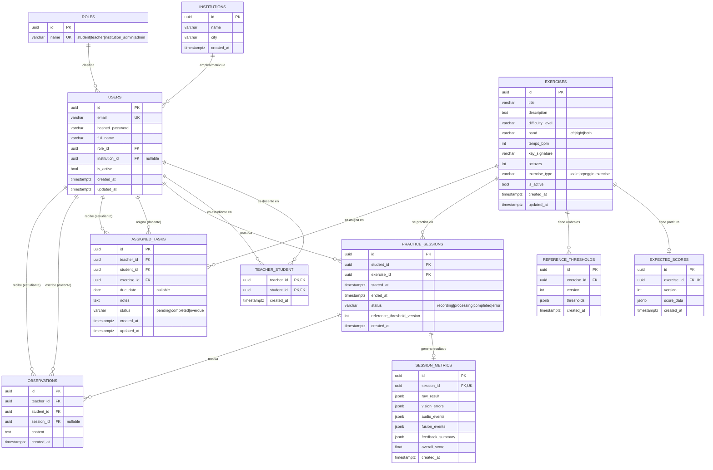

# Modelo Entidad-Relación — SkillTrack Piano

> Este diagrama renderiza automáticamente en GitHub. Para exportar como imagen, usar https://mermaid.live

```mermaid
erDiagram
    INSTITUTIONS ||--o{ USERS : "emplea/matricula"
    ROLES ||--o{ USERS : "clasifica"
    USERS ||--o{ TEACHER_STUDENT : "es docente en"
    USERS ||--o{ TEACHER_STUDENT : "es estudiante en"
    USERS ||--o{ PRACTICE_SESSIONS : "practica"
    USERS ||--o{ ASSIGNED_TASKS : "asigna (docente)"
    USERS ||--o{ ASSIGNED_TASKS : "recibe (estudiante)"
    USERS ||--o{ OBSERVATIONS : "escribe (docente)"
    USERS ||--o{ OBSERVATIONS : "recibe (estudiante)"
    EXERCISES ||--o| EXPECTED_SCORES : "tiene partitura"
    EXERCISES ||--o{ REFERENCE_THRESHOLDS : "tiene umbrales"
    EXERCISES ||--o{ PRACTICE_SESSIONS : "se practica en"
    EXERCISES ||--o{ ASSIGNED_TASKS : "se asigna en"
    PRACTICE_SESSIONS ||--o| SESSION_METRICS : "genera resultado"
    PRACTICE_SESSIONS ||--o{ OBSERVATIONS : "motiva"

    INSTITUTIONS {
        uuid id PK
        varchar name
        varchar city
        timestamptz created_at
    }

    ROLES {
        uuid id PK
        varchar name UK "student|teacher|institution_admin|admin"
    }

    USERS {
        uuid id PK
        varchar email UK
        varchar hashed_password
        varchar full_name
        uuid role_id FK
        uuid institution_id FK "nullable"
        bool is_active
        timestamptz created_at
        timestamptz updated_at
    }

    TEACHER_STUDENT {
        uuid teacher_id PK,FK
        uuid student_id PK,FK
        timestamptz created_at
    }

    EXERCISES {
        uuid id PK
        varchar title
        text description
        varchar difficulty_level
        varchar hand "left|right|both"
        int tempo_bpm
        varchar key_signature
        int octaves
        varchar exercise_type "scale|arpeggio|exercise"
        bool is_active
        timestamptz created_at
        timestamptz updated_at
    }

    EXPECTED_SCORES {
        uuid id PK
        uuid exercise_id FK,UK
        int version
        jsonb score_data
        timestamptz created_at
    }

    REFERENCE_THRESHOLDS {
        uuid id PK
        uuid exercise_id FK
        int version
        jsonb thresholds
        timestamptz created_at
    }

    PRACTICE_SESSIONS {
        uuid id PK
        uuid student_id FK
        uuid exercise_id FK
        timestamptz started_at
        timestamptz ended_at
        varchar status "recording|processing|completed|error"
        int reference_threshold_version
        timestamptz created_at
    }

    SESSION_METRICS {
        uuid id PK
        uuid session_id FK,UK
        jsonb raw_result
        jsonb vision_errors
        jsonb audio_events
        jsonb fusion_events
        jsonb feedback_summary
        float overall_score
        timestamptz created_at
    }

    ASSIGNED_TASKS {
        uuid id PK
        uuid teacher_id FK
        uuid student_id FK
        uuid exercise_id FK
        date due_date "nullable"
        text notes
        varchar status "pending|completed|overdue"
        timestamptz created_at
        timestamptz updated_at
    }

    OBSERVATIONS {
        uuid id PK
        uuid teacher_id FK
        uuid student_id FK
        uuid session_id FK "nullable"
        text content
        timestamptz created_at
    }
```
